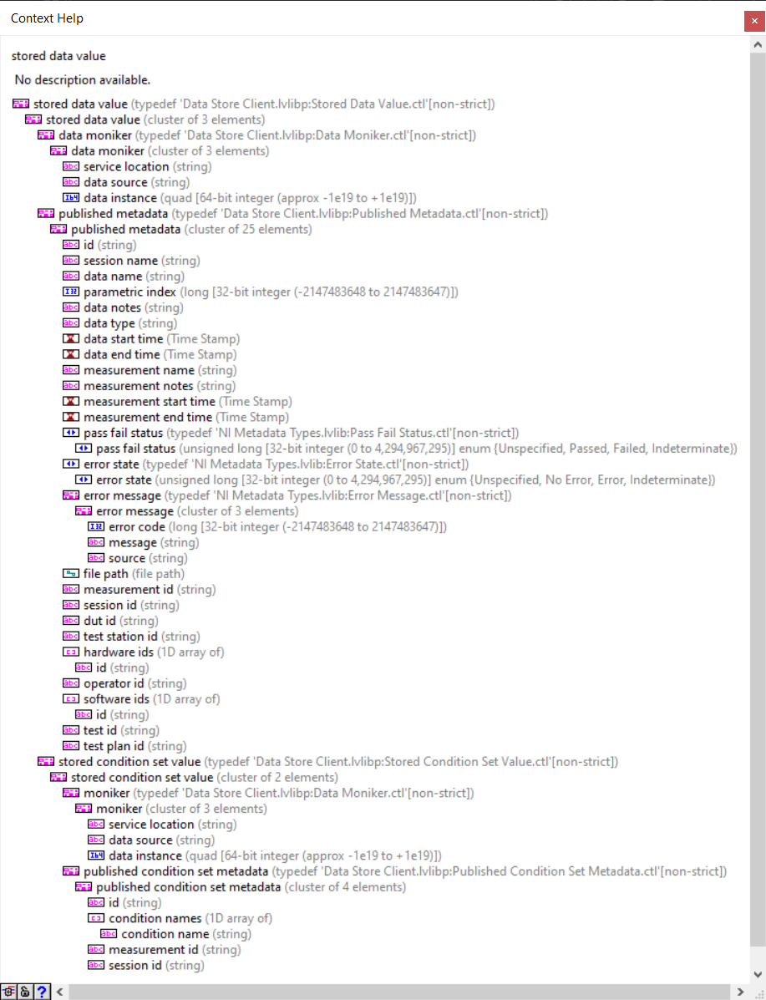
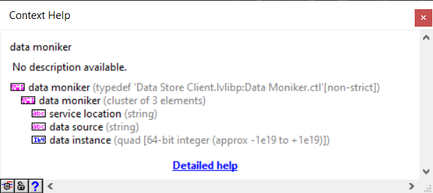
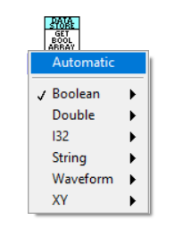
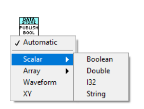
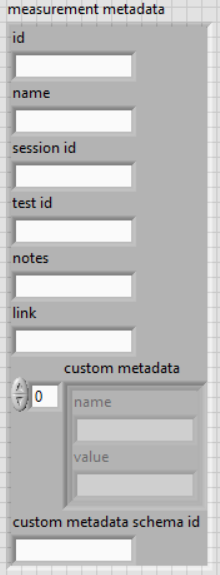
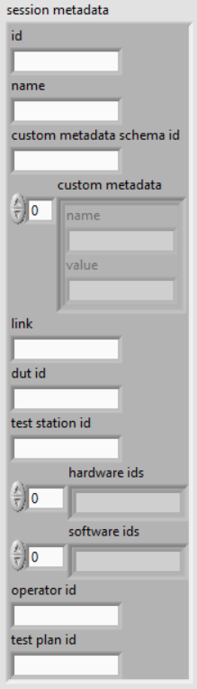

# Design of the Python Data Store API

## API Needs

### Data Type: Stored Data Value (SDV)

### Data Type: Data Moniker

### Get Data - Read Data from a Moniker or SDV

LabVIEW API uses a polymorphic VI. We probably need one Python 'Get Data' method for each data flavor?

### Publish Data - Publish Data to the Data Store

LabVIEW API uses a polymorphic VI. We probably need one Python 'Publish Data' method for each data flavor?

### Metadata Type: Measurement Metadata

### Metadata Type: Session Metadata

